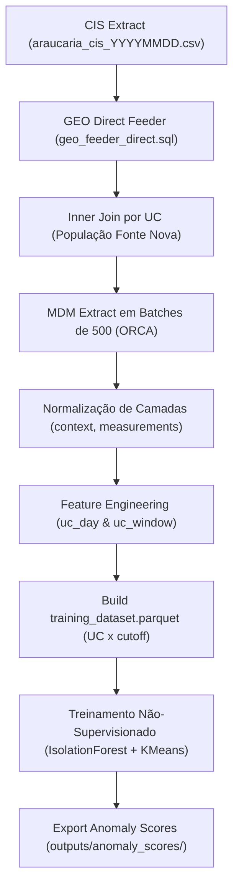

# Arquitetura de Dados para Detecção de Anomalias em Smart Grids

**Projeto:** Extração, Normalização e Engenharia de Atributos em Dados de Medição Inteligente (AMI)  
**Entidade Analítica Central:** Unidade Consumidora ($\text{UC}$)  
**Unidade Amostral para Machine Learning:** $\text{UC} \times \text{cutoff\_date}$  
**Versão:** 2.0  
**Data:** Setembro de 2026  

---

## 1. Princípio Fundamental

> **"AMI é fenômeno. Cadastro, medidor e GEO são contexto. Alarmes são eventos."**

Em vez de consolidar todas as informações em uma tabela desnormalizada com atributos heterogêneos e JSONs aninhados, a arquitetura divide os dados em camadas semânticas bem definidas, convergindo na camada de modelagem para a unidade analítica unificada.

```text
                         UC
                         │
       ┌─────────────────┼─────────────────┐
       │                 │                 │
       ▼                 ▼                 ▼
   Cadastro            Medidor             GEO
   estático            histórico          hierarquia
       │                 │                 │
       └─────────────────┼─────────────────┘
                         │
                         ▼
                    CONTEXTO UC
                         │
                         ├──────────────┐
                         │              │
                         ▼              ▼
                       AMI            Alarmes
                  série temporal       eventos
                         │              │
                         └──────┬───────┘
                                ▼
                       FEATURE ENGINEERING
                                │
                                ▼
                       UC × CUTOFF_DATE
                                │
                                ▼
                            ML DATASET
```

---

## 2. Estrutura Física do Datalake

Os dados são armazenados no formato colunar **Apache Parquet** (com suporte a *predicate pushdown* e *projection pushdown* via Polars) na seguinte árvore de diretórios:

```text
output/
│
├── raw/                                  # Dados brutos das extrações
│   ├── CIS/
│   ├── GEO/
│   └── ORCA/
│
├── context/                              # Camada 1: Contexto da UC e da rede
│   ├── uc_context.parquet
│   ├── meter_installation_history.parquet
│   └── electrical_hierarchy.parquet
│
├── measurements/                         # Camada 2: Fenômeno (Séries temporais AMI)
│   ├── ami_interval/report_year=YYYY/report_month=MM/report_day=DD/data.parquet
│   ├── ami_instantaneous/report_year=YYYY/report_month=MM/report_day=DD/data.parquet
│   └── ami_registers/report_year=YYYY/report_month=MM/report_day=DD/data.parquet
│
├── events/                               # Camada 3: Eventos operacionais
│   └── alarm_events/report_year=YYYY/report_month=MM/report_day=DD/data.parquet
│
├── features/                             # Camada 4: Atributos engenheirados
│   ├── uc_day_features/feature_set_version=v1/report_year=YYYY/report_month=MM/report_day=DD/data.parquet
│   └── uc_window_features/feature_set_version=v1/cutoff_year=YYYY/cutoff_month=MM/cutoff_day=DD/data.parquet
│
├── labels/                               # Camada 5: Rótulos e validações de campo
│   └── uc_labels/label_version=v1/data.parquet
│
├── model_input/                          # Camada 6: Matriz final para scikit-learn
│   └── v1/
│       ├── training_dataset.parquet
│       └── training_dataset.csv
│
└── outputs/                              # Resultados de inferência e pontuações
    └── anomaly_scores/
        └── anomaly_scores_YYYYMMDD_HHMMSS.parquet
```

---

## 3. Especificação das Camadas e Schemas

### 3.1 Camada de Contexto (`context/`)

#### A. `uc_context.parquet`
* **Grão:** $1 \text{ linha por } \text{UC}$.
* **Finalidade:** Perfil comercial, elétrico e espacial estático da instalação.
* **Regra de Privacidade/ML:** Não armazena endereços textuais (rua, número). Mantém granularidades agregadas (`MUNICIPIO`, `BAIRRO`, `LATITUDE`, `LONGITUDE`).
* **Campos Principais:**
  * `UC` (Chave Primária)
  * `COD_LOCALIDADE`, `COD_GRUPO_FAT`, `COD_SUB_GRUPO_FAT`, `TARIFA_FATURA`
  * `CLASSE`, `FASE_CIRCUITO`, `TENSAO_BASE`, `TENSAO_SEC`, `DEMANDA`, `STATUS_FAT`, `DISJUNTOR`, `CONSUMO_ESTM`
  * `INICIO_UC`, `STATUS_LIGACAO`, `TIPO_UC`, `LOC_UB_RR`
  * `MUNICIPIO`, `BAIRRO`, `LATITUDE`, `LONGITUDE`

#### B. `meter_installation_history.parquet`
* **Grão:** $\text{UC} \times \text{NIO} \times \text{DATA\_INSTALACAO}$.
* **Finalidade:** Histórico temporal do equipamento físico (medidor) vinculado à UC analítica.
* **Regra Temporal de Junção com AMI:**
  $$\text{DATA\_INSTALACAO} \le \text{timestamp}_{AMI} < \text{DATA\_REMOCAO}$$
* **Campos Principais:**
  * `UC`, `NIO`, `DATA_INSTALACAO`, `DATA_REMOCAO`
  * `COD_SUBTIPO`, `DESCRICAO_TIPO`, `FAMILIA_SMART`, `FASE`

#### C. `electrical_hierarchy.parquet`
* **Grão:** $1 \text{ linha por } \text{UC}$.
* **Finalidade:** Topologia da rede elétrica para cálculo de balanço energético e perdas.
  $$\text{Subestação} \longrightarrow \text{Alimentador} \longrightarrow \text{Posto/Transformador} \longrightarrow \text{UC} \longrightarrow \text{NIO}$$
* **Campos Principais:**
  * `UC`, `NIO`
  * `SUBESTACAO`, `SIGLA_SE`, `TENSAO_SE`, `CAR_SE`, `MUNICIPIO_SE`, `COD_MUN_SE`
  * `GEDIS_ALIMENTADOR`, `ALIMENTADOR`, `TENSAO_ALIMENTADOR`
  * `POSTO_OPERACIONAL`, `POT_INST_KVA`
  * `COORD_X_POSTE`, `COORD_Y_POSTE`, `LAT_POSTE_WGS84`, `LONG_POSTE_WGS84`

---

### 3.2 Camada de Medições / Fenômeno (`measurements/`)

Separada em três tabelas para acomodar grandezas físicas e cadências distintas sem inflar nulos:

1. **`ami_interval`**: Médias e integrais físicas por intervalo (cadências típicas: 5, 10 ou 15 min).
   * *Campos:* `NIO`, `REPORT_DAY`, `TIMESTAMP_UTC`, `TIMESTAMP_LOCAL`, `CADENCE_MINUTES`, `FA_INTERVAL`, `RA_INTERVAL`, `I_L1_AVG..3`, `U_L1_AVG..3`, `R_Q1..4_INTERVAL`, `QUALITY_CODE`.
2. **`ami_instantaneous`**: Leituras instantâneas amostradas (cadências típicas: 15 ou 60 min).
   * *Campos:* `NIO`, `REPORT_DAY`, `TIMESTAMP_UTC`, `U_L1..3`, `I_INSTANT_L1..3`, `QUALITY_CODE`.
3. **`ami_registers`**: Snapshots acumuladores de registradores e demanda (tipicamente a cada 6 horas).
   * *Campos:* `NIO`, `REPORT_DAY`, `TIMESTAMP_UTC`, `REGISTER_GROUP`, `FA_TOTAL`, `FA_T1..4_TOTAL`, `RA_TOTAL`, `RA_T1..4_TOTAL`, `FA_MD`, `FA_MD_T1..4`.

---

### 3.3 Camada de Eventos (`events/`)

#### `alarm_events.parquet`
* **Grão:** $1 \text{ linha por } \text{ALARM\_ID}$.
* **Vinculação:** O campo `OBJ_ID` corresponde diretamente ao `NIO` (8 dígitos, sem zero à esquerda).
* **Campos Principais:**
  * `ALARM_ID`, `NIO`
  * `ORIGIN_TIMESTAMP`, `RECEIVED_TIMESTAMP`
  * `LATENCY_SECONDS` ($\text{RECEIVED\_TIMESTAMP} - \text{ORIGIN\_TIMESTAMP}$)
  * `SYSTEM_CODE`, `CONTENT`, `OBJECT_TYPE`, `OBJECT_ORG`

---

### 3.4 Camada de Atributos (`features/`)

1. **`uc_day_features`**: Atributos calculados por dia civil ($\text{UC} \times \text{REPORT\_DAY}$).
   * Cobertura e falhas: `INTERVAL_COVERAGE`, `NULL_RATIO_INTERVAL`.
   * Grandezas agregadas: somas de energia ativa direta/reversa, demanda máxima, fator de carga (`LOAD_FACTOR`).
   * Qualidade de energia: desequilíbrios máximos de tensão (`VOLTAGE_IMBALANCE_MAX`) e corrente (`CURRENT_IMBALANCE_MAX`).
   * Estatísticas robustas: mediana, IQR, p05, p95 e desvio padrão.
   * Dinâmica temporal: autocorrelação lag-1 (`FA_INTERVAL_AUTOCORR_LAG1`), rampa máxima (`FA_RAMP_MAX`) e componentes cíclicas do horário de pico (`PEAK_HOUR_SIN`, `PEAK_HOUR_COS`).
2. **`uc_window_features`**: Atributos calculados em janelas históricas deslizantes ($\text{UC} \times \text{CUTOFF\_DATE} \times \text{WINDOW\_DAYS}$, ex.: 30 dias).
   * Estatísticas da janela: mediana histórica (`HIST_FA_SUM_MEDIAN`), desvio absoluto da mediana (`HIST_FA_SUM_MAD`), dias com reversão de fluxo (`HIST_RA_REVERSAL_DAYS`).
   * Tendência: inclinação de regressão linear do consumo no período (`TREND_FA_SLOPE`).
   * Contexto do equipamento: idade do medidor em dias (`METER_AGE_DAYS`), flags de troca recente (`METER_CHANGED_30D`, `METER_CHANGED_90D`).
   * Eventos: contagem de alarmes no período (`ALARM_COUNT_WINDOW`), latência média de comunicação (`AVG_ALARM_LATENCY_SEC`).

---

### 3.5 Camada de Entrada para Modelagem (`model_input/`)

#### `training_dataset.parquet`
* **Grão:** $\text{UC} \times \text{CUTOFF\_DATE}$.
* **Convenção Estrita de Prefixos de Colunas (Anti-Leakage):**

| Prefixo | Papel | Exemplo | Enviado para o Estimador ($X$)? |
| :--- | :--- | :--- | :---: |
| `id__*` | Identificadores / Auditoria | `id__uc_id` | **Não** |
| `meta__*` | Metadados de Corte e Partição | `meta__cutoff_date`, `meta__split`, `meta__window_days` | **Não** |
| `x__*` | Atributos de Entrada do Modelo | `x__hist_fa_sum_median`, `x__load_factor`, `x__meter_age_days` | **Sim** |
| `y__*` | Rótulos de Verdade Terrestre | `y__target_irregularity` | **Não** (apenas target) |

---

## 4. Pipeline e Automação

### 4.1 Estratégia Populacional (Alimentador Específico)
Para conciliar tempo de execução e representatividade topológica, o pipeline opera em nível de **Alimentador Completo**:
* **Alimentador Piloto:** *Fonte Nova* (`GEO_ID = 6352460`).
* **Volume:** $\approx 1.500 \text{ a } 3.000$ medidores.
* **Tempo de Execução:** $\approx 2 \text{ a } 5$ minutos.

### 4.2 Fluxo de Execução Automatizado



---

## 5. Como Executar

Na raiz do projeto (`d:\Projects\tcc_extraction`):

### Extração Completa do Alimentador e Geração do Dataset
```cmd
run_feeder.cmd
```
*(Ou diretamente: `python scripts/run_feeder_pipeline.py --days-back 1`)*

### Treinamento / Re-treinamento do Modelo de Anomalias
```cmd
python scripts/train_anomaly_model.py --input output/model_input/v1/training_dataset.parquet --contamination 0.05
```

